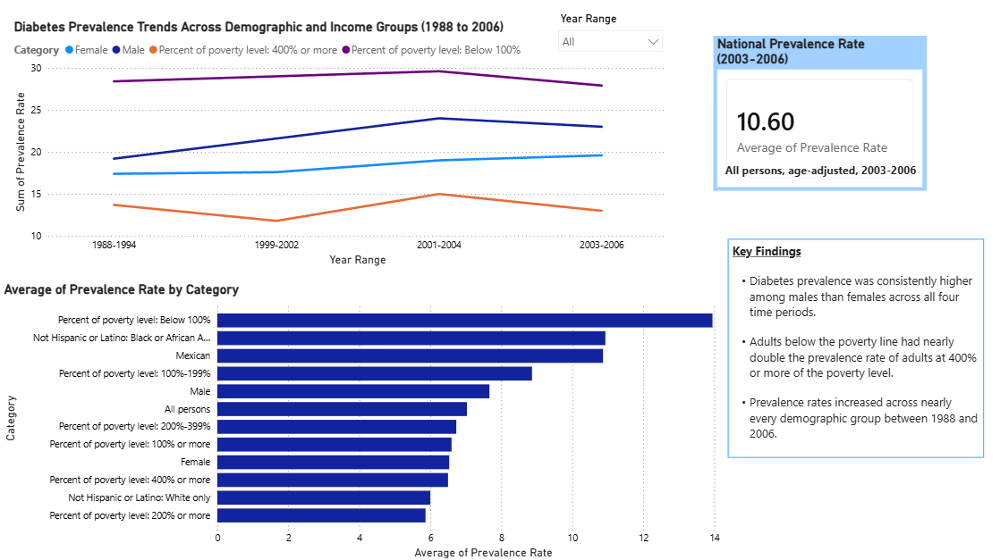

# Diabetes Prevalence Dashboard

A Power BI dashboard analyzing diabetes prevalence trends across demographic and 
income groups in the United States, built using CDC public health data spanning 
1988 to 2006.

## What it does

This dashboard explores how diabetes prevalence varies by gender, race and ethnicity, 
and income level over four survey periods. It includes:

- **Trend line chart**: Diabetes prevalence over time for select demographic groups
- **Comparison bar chart**: Average prevalence rate ranked across all demographic categories
- **National prevalence KPI**: The overall national diabetes rate for the most recent period
- **Interactive slicer**: Filter the dashboard by year range
- **Key findings**: A summary of the most notable patterns in the data

## Key findings

- Diabetes prevalence was consistently higher among males than females across all 
four time periods
- Adults below the poverty line had nearly double the prevalence rate of adults at 
400% or more of the poverty level
- Prevalence rates increased across nearly every demographic group between 1988 and 2006

## Tools used

- Power BI Desktop
- Power Query (data cleaning and reshaping)

## Data source

Sourced from a CDC dataset on Kaggle, originally published as part of "Health, 
United States 2011": diabetes prevalence and glycemic control among adults 20 
years and over, by sex, age, race, and Hispanic origin (selected years 1988-1994 
through 2003-2006). The raw dataset is included in this repository as diabetes_data.csv.

## Notes

This dataset reflects historical data through 2006 and is used here to demonstrate 
data cleaning, reshaping, and dashboard design skills rather than to represent 
current diabetes prevalence rates.
